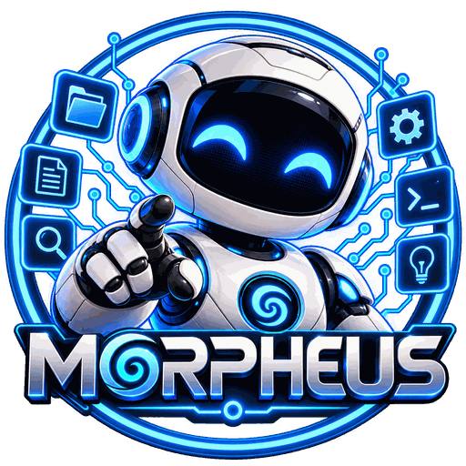

<p align="center"></p>

# Morpheus AI Agent

**Un assistant de programmation dans ton terminal, ton navigateur ou Telegram, à la manière de
Claude Code — qui fonctionne avec des modèles locaux (Ollama, llama.cpp), les modèles cloud
d'Ollama, ou en pilotant Claude Code.**

*English summary: Morpheus AI Agent is a French-language coding agent (terminal, web UI and Telegram
bot) in a single Python file with no dependencies. It drives local models through Ollama or
llama.cpp, Ollama cloud models, or Claude Code, and asks for your approval before any change.
Linux, Python 3.10+, MIT license.*

---


Morpheus lit tes fichiers, les modifie, lance des commandes, cherche sur le web… et **te montre
chaque action avant de la faire** : un diff pour une modification de fichier, la commande complète
pour bash, avec validation *oui / non / toujours*. `/annuler` défait la dernière demande.

- **Un seul fichier, zéro dépendance** : `morpheus.py`, bibliothèque standard de Python uniquement.
  Rien à installer avec pip.
- **Pensé pour les modèles locaux** : les petits modèles inventent des noms d'outils, oublient des
  paramètres, écrivent leurs appels en texte ou prétendent avoir fini ; Morpheus le rattrape dans le
  code (alias, vérifications, relances).
- **Modes** : *Chat* (lecture et web, aucune modification), *Développeur* (modifications validées),
  *Plan* (explorer et proposer), *Auto* (modifications du projet et commandes jugées sûres sans
  question, les autres restent demandées).
- **Sécurité** : `sudo`, `rm -rf /`… toujours refusés ; écriture de fichier par bash refusée ;
  lectures et écritures hors du projet demandées ; commandes arrêtées avec tous leurs processus.
- **Interface web** : chat en direct, volet de code et de diff, projets et conversations, pièces
  jointes, invités avec leur propre espace, file d'attente.
- **Telegram** : ton bot personnel, avec boutons de validation.
- **Claude Code** : choisis le modèle `claude-code` (ou `claude-code:opus`…) et Morpheus pilote
  Claude Code avec ton abonnement, en gardant ses propres validations.
- **10 modes de conversation** (Expert, Pédagogique, Relecteur, Coach…) et les tiens.
- Tout en **français** : interface, messages et consignes au modèle.

## Installation

Il faut Linux, Python 3.10 ou plus, et [Ollama](https://ollama.com) avec un modèle (ou llama-server,
ou Claude Code).

```bash
git clone https://github.com/JIMMYASH/morpheus-ai-agent.git ~/outils/morpheus
echo "alias morpheus='python3 ~/outils/morpheus/morpheus.py'" >> ~/.bashrc
source ~/.bashrc
```

## Utilisation

```bash
cd ~/projets/mon-projet
morpheus                     # terminal (mode Chat au départ, /dev pour modifier)
morpheus --web               # interface web (lien avec jeton affiché au lancement)
morpheus --telegram          # relier un bot Telegram (une fois)
MORPHEUS_MODELE=qwen3-coder:30b morpheus    # choisir le modèle
```

Configuration dans `~/.config/morpheus/config.json`, par exemple :

```json
{ "modele": "qwen3-coder:30b", "num_ctx": 65536, "mode": "chat" }
```

Toute la documentation (modes, sécurité, web, Telegram, Claude Code, configuration, dépannage) est
dans **[DOCUMENTATION.md](DOCUMENTATION.md)**.

## Avertissement

Morpheus exécute des commandes et modifie des fichiers **avec les droits de ton compte** : ce n'est
pas un bac à sable. Relis ce qu'il propose avant de valider, surtout en mode auto. L'interface web
est en HTTP non chiffré, protégée par un jeton : réserve-la à un réseau de confiance. Les invités
utilisent ton compte Linux : n'invite que des personnes de confiance.

## Contribuer

Les contributions sont bienvenues : voir [CONTRIBUTING.md](CONTRIBUTING.md). Les tests tournent sans
aucun vrai modèle : `bash tests/lance_tests.sh`.

## Licence

[MIT](LICENSE). Fourni sans aucune garantie. Morpheus n'est pas affilié à Anthropic ; l'intégration
avec Claude Code lance le programme `claude` que tu as installé et connecté toi-même.
